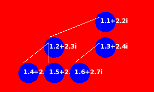

# Tree Visualization with SFML and Complex Numbers

Welcome to our Tree Visualization project, a cutting-edge tool developed with SFML (Simple and Fast Multimedia Library) in C++. This project stands out by incorporating complex numbers within the tree nodes, offering a unique perspective on mathematical concepts through interactive visualization.

## Overview

Our project introduces a versatile Tree data structure that is templated to work with complex numbers. By leveraging SFML, we provide a dynamic and visually appealing way to represent trees, where each node is depicted as a circle displaying its associated complex number value.

## Key Features

- **Templated Tree Class**: Seamlessly integrates complex numbers, enhancing the visualization of mathematical properties.
- **Dynamic Visualization**: Real-time rendering powered by SFML, showcasing nodes as intuitive circles with complex number values.
- **Traversal Support**: Implements Depth-First Search (DFS), Breadth-First Search (BFS), and Min-Heap traversal, catering to a variety of use cases.
- **Custom Iterators**: Custom iterators (`TREE_DFSIterator`, `TREE_BFSIterator`, `MinHeapIterator`) for efficient traversal through the tree.
- **Interactive Exploration**: SFML integration enables dynamic interaction with the tree structure, fostering a deeper understanding of tree-based algorithms.

## Getting Started

To start working with this project, ensure you have SFML installed and properly configured in your development environment. Detailed installation instructions can be found on the [SFML website](https://www.sfml-dev.org/tutorials/2.5/start.php).
